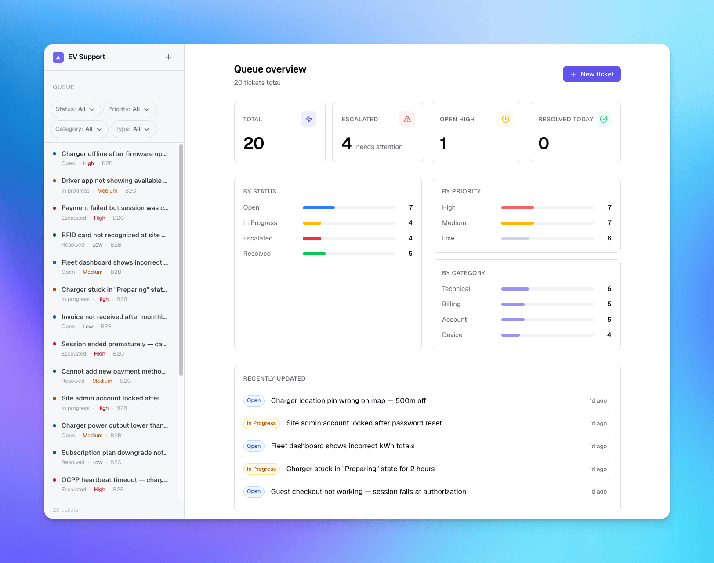

# Virta Tech Support Specialist Portfolio

Hi! I'm [Mchael Poncardas](https://poncardas.com/), and I created this portfolio for my application to the Technical Support Specialist role at Virta. It shows how I approach technical support work in practice and covers concrete parts of the role, including support workflows, SQL analysis, documentation, and EV charging domain knowledge.

These are practical working examples that show how I approach real support problems.

## Projects

| #                            | Project                              | What it demonstrates                                                         |
| ---------------------------- | ------------------------------------ | ---------------------------------------------------------------------------- |
| [01](./01-knowledge-base/)   | **Troubleshooting Knowledge Base**   | Technical documentation, structured issue resolution, knowledge sharing      |
| [02](./02-sql-analysis/)     | **EV Charging Session SQL Analysis** | SQL queries for root cause analysis, billing and session issue investigation |
| [03](./03-ticket-tracker/)   | **Support Ticket Tracker**           | CRM/Zendesk-style workflows, ticket lifecycle, escalation logic              |
| [04](./04-report-generator/) | **Weekly Support Report Generator**  | Process automation, pattern identification, cross-team communication         |
| [05](./05-ocpp-client/)      | **OCPP Charger Simulator**           | EV charging protocol understanding, technical depth in the product domain    |

## 01 — Troubleshooting Knowledge Base

A structured set of troubleshooting articles written for a fictional EV charging support team. Covers the most common customer issue categories: connectivity, payment, session handling, and hardware.

**Demonstrates:** technical documentation, knowledge base maintenance, escalation criteria — the kind of content that lives in Confluence.

→ [View project](./01-knowledge-base/)

## 02 — EV Charging Session SQL Analysis

A mock PostgreSQL database of charging sessions, users, stations, and payment events — with SQL queries that answer real support investigation questions:

- Sessions that started but never completed
- Payment failures grouped by station and user
- Stations with abnormal session durations
- Duplicate charges and billing discrepancies

**Demonstrates:** SQL for issue analysis, root cause thinking, and the ability to work with data to surface patterns.

→ [View project](./02-sql-analysis/)

## 03 — Support Ticket Tracker

A lightweight web app modelling the core of a Zendesk-style support queue: create and update tickets, filter by status and priority, add internal escalation notes, and distinguish B2B from B2C issues.

**Demonstrates:** CRM tool logic, ticket lifecycle management, and the separation between internal and customer-facing communication.

→ [View project](./03-ticket-tracker/)

## 04 — Weekly Support Report Generator

A Python CLI script that takes a CSV of raw ticket data and produces a formatted weekly summary: resolution times, SLA breach count, top issue categories, open vs closed ratio. Output is a clean markdown report ready to share with the team.

**Demonstrates:** process improvement mindset, surfacing patterns from support data, and practical scripting for operational work.

→ [View project](./04-report-generator/)

## 05 — OCPP Charger Simulator

A minimal OCPP 1.6 WebSocket client that simulates a charging station communicating with a backend. Sends and logs `BootNotification`, `Heartbeat`, `StartTransaction`, `StopTransaction`, and `StatusNotification` messages.

**Demonstrates:** understanding of the protocol Virta's hardware runs on, and genuine interest in the product domain beyond the support queue.

→ [View project](./05-ocpp-client/)

## About Me

I'm Mchael Poncardas — an IT Systems Specialist based in Helsinki, with a background in technical support, incident handling, and system troubleshooting.

- Email: m@poncardas.com
- LinkedIn: [linkedin.com/in/poncardas](https://www.linkedin.com/in/poncardas/)
- Website: [poncardas.com](https://www.poncardas.com)
